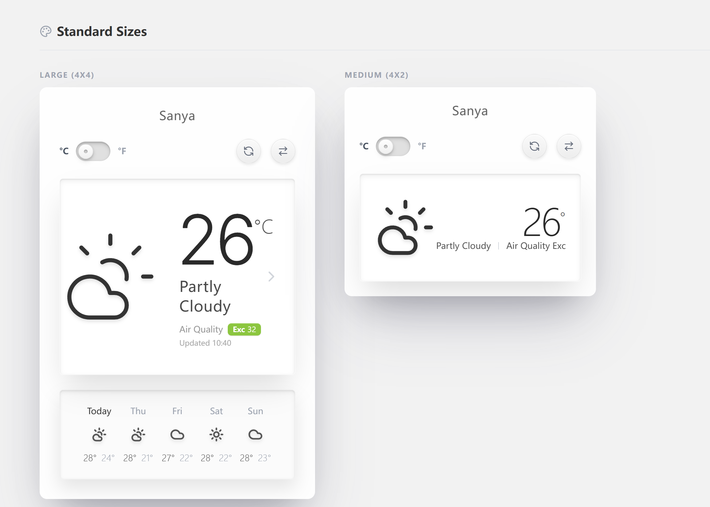
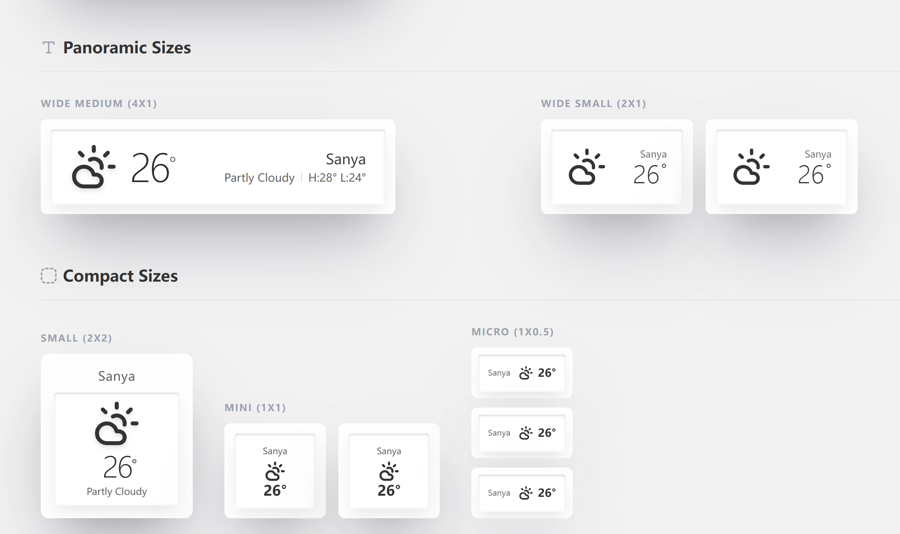

# 锤子天气 React 组件库 (Smartisan Weather React Component Kit)

[English](./README.md) | [中文](./README.zh-CN.md)

高度复刻 Smartisan OS (锤子科技) 天气应用的精美设计，构建为现代化的 React 组件库。本项目采用拟物化与简洁设计相结合的风格 ("新拟物化")，致敬锤子科技对细节的极致追求。




## ✨ 特性

*   **7 种响应式尺寸**:
    *   `Large` (4x4): 完整详情，预报，空气质量。
    *   `Medium` (4x2): 仪表盘水平布局。
    *   `Wide Medium` (4x1): 横幅样式。
    *   `Wide Small` (2x1): 紧凑水平布局。
    *   `Small` (2x2): 紧凑垂直布局。
    *   `Mini` (1x1): 极简方形。
    *   `Micro` (1x0.5): 超紧凑胶囊形。
*   **国际化 (i18n)**: 内置支持中文（简体）和英文。
*   **实时天气**: 由 Open-Meteo API 提供支持（无需 API Key）。
*   **位置搜索**: 集成地理编码 API 以搜索并切换全球城市。
*   **美学细节**:
    *   支持动画的自定义 SVG 图标。
    *   "内陷"文字效果和柔和阴影。
    *   拟物化切换开关和按钮。
    *   物理开关交互用于单位转换 (°C/°F)。

## 🛠 技术栈

*   **框架**: React 18+
*   **样式**: Tailwind CSS
*   **图标**: Lucide React
*   **数据源**: Open-Meteo (Forecast API & Geocoding API)
*   **语言**: TypeScript

## 🚀 快速开始

1.  **克隆仓库**
2.  **安装依赖**:
    ```bash
    npm install
    # or
    yarn install
    ```
3.  **启动开发服务器**:
    ```bash
    npm run dev
    ```

## 📦 使用方法

### 安装

```bash
npm install tactile-weather
```

### 前置要求

本组件库使用 **Tailwind CSS** 进行样式管理。请确保您的项目已配置 Tailwind CSS。

同时需要引入组件库的 CSS 变量文件：

```ts
import 'tactile-weather/dist/tactile-weather.css';
```

### 基础示例

```tsx
import 'tactile-weather/dist/tactile-weather.css';
import { WeatherWidget } from 'tactile-weather';

// ... 在你的组件中
<WeatherWidget 
  size="large" 
  data={weatherData} 
  loading={false} 
  unit="C" 
  locationName="北京"
  lang="zh"
  onToggleUnit={() => {}}
  onRefresh={() => {}}
/>
```

### 主题（包含暗夜主题）

暗夜模式作为一个主题预设存在（不再需要单独的日夜开关）。使用 `ThemeProvider` 设置 `light/dark`，并可通过 `customTheme` 覆盖 CSS 变量：

```tsx
import 'tactile-weather/dist/tactile-weather.css';
import { ThemeProvider, WeatherWidget } from 'tactile-weather';

const customTheme = {
  '--twx-bg-app': '#0f172a',
  '--twx-text-primary': '#f8fafc',
};

<ThemeProvider initialTheme="dark" customTheme={customTheme}>
  <WeatherWidget {...props} />
</ThemeProvider>;
```

### 组件 API

#### `<WeatherWidget />`

| 属性 (Prop) | 类型 (Type) | 默认值 | 描述 |
|-------------|-------------|--------|------|
| `size` | `'large' \| 'medium' \| 'small' \| 'mini' \| 'wide-small' \| 'wide-medium' \| 'micro'` | 必填 | 控制组件的布局和尺寸。 |
| `data` | `WeatherData \| null` | 必填 | 天气数据对象。 |
| `loading` | `boolean` | `false` | 为 true 时显示加载骨架屏。 |
| `unit` | `'C' \| 'F'` | `'C'` | 温度单位。 |
| `locationName` | `string` | 必填 | 显示的城市名称。 |
| `lang` | `'zh' \| 'en'` | `'zh'` | UI 界面语言。 |
| `onToggleUnit` | `() => void` | 必填 | 点击单位切换开关时的回调。 |
| `onRefresh` | `() => void` | 必填 | 点击刷新按钮时的回调。 |
| `onLocationSelect` | `(loc: Location) => void` | 可选 | 从搜索中选择新地点时的回调。 |

#### 数据结构 (`WeatherData`)

```typescript
interface WeatherData {
  current: {
    temp: number;       // 温度
    weatherCode: number; // 天气代码 (OpenMeteo)
    humidity: number;   // 湿度 %
    windSpeed: number;  // 风速 km/h
    aqi: number;        // 空气质量指数 0-500
  };
  forecast: Array<{
    date: string;       // YYYY-MM-DD
    maxTemp: number;
    minTemp: number;
    weatherCode: number;
  }>;
}
```

## 🌍 国际化

应用支持 `zh` (中文) 和 `en` (英文)。

要以编程方式切换语言，请将 `lang` 属性传递给 `WeatherWidget`。演示中的 `App.tsx` 包含了一个全局切换的示例。

## 📄 许可证

MIT License. Designed for educational purposes and UI research.
Original design inspiration credit to Smartisan OS.
